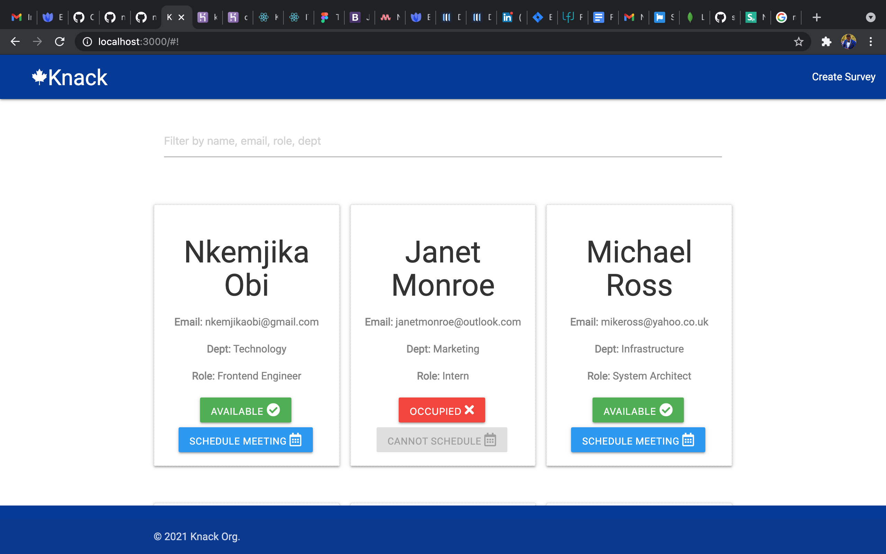

# knack
LIVE URL:  https://knack-co.herokuapp.com/

<h1>Knack</h1>

An employee directory

This is a project for an individual to view all employees in an organization, schdule meetings with available employees and also create surveys

Employees can be filtered by name, department, role and email

An Employee directory built with REACT, NODEJS, EXPRESS AND MONGODB
* <h3>Context API</h3> is used for STATE MANAGEMENT
* <h3>MATERIALIZE CSS</h3> is used for the UI
* <h3>The Moragn middleware is used to show logs</h3>
* <h3>The <h5>CONFIG</h5> dependency is used to store environment variables</h3>

<h1>Clone The Repository</h1>
<code><pre>git clone https://github.com/nkemjikaobi/knack.git</pre></code>

<h1>CD into the project</h1>
<code><pre>cd knack</pre></code>

<h1>Running the Project.</h1>
Install dependencies with <code><pre>npm install</pre></code>

Run <code><pre>npm run dev</pre></code> { this will concurrently run the server and the client side }

* Check all dependencies and devdependecies used in **package.json**

<h1>Next steps</h1>
Visit http://localhost:3000

You can now view all employees and filter through them.

